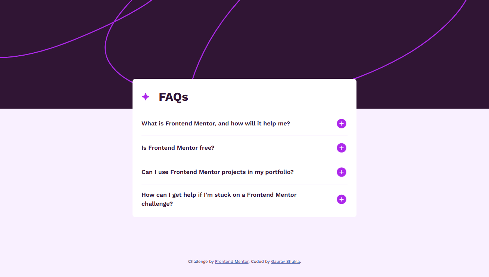

# Frontend Mentor - FAQ accordion solution

This is a solution to the [FAQ accordion challenge on Frontend Mentor](https://www.frontendmentor.io/challenges/faq-accordion-wyfFdeBwBz). Frontend Mentor challenges help you improve your coding skills by building realistic projects.

## Table of contents

- [Overview](#overview)
  - [The challenge](#the-challenge)
  - [Screenshot](#screenshot)
  - [Links](#links)
- [My process](#my-process)
  - [Built with](#built-with)
  - [What I learned](#what-i-learned)
  - [Useful resources](#useful-resources)
- [Author](#author)

## Overview

### The challenge

Users should be able to:

- Hide/Show the answer to a question when the question is clicked
- Navigate the questions and hide/show answers using keyboard navigation alone
- View the optimal layout for the interface depending on their device's screen size
- See hover and focus states for all interactive elements on the page

### Screenshot



### Links

- Solution URL: [Add solution URL here](https://your-solution-url.com)
- Live Site URL: [Click here](https://heygauravshukla.github.io/faq-accordion)

## My process

### Built with

- Semantic HTML5 markup
- CSS custom properties
- Flexbox
- CSS Grid
- Mobile-first workflow

### What I learned

I learned how to use the details and summary elements to create a accordion without using any JavaScript.

Here's how you can easily create an accordion in HTML:

```html
<details>
  <summary>What is Frontend Mentor, and how will it help me?</summary>
  Frontend Mentor offers realistic coding challenges to help developers improve
  their frontend coding skills with projects in HTML, CSS, and JavaScript. It's
  suitable for all levels and ideal for portfolio building.
</details>
```

To style the content part of a details element, use this selector:

```css
::details-content {
  /* Add styles here */
}
```

### Useful resources

- [MDN docs on details element](https://developer.mozilla.org/en-US/docs/Web/HTML/Reference/Elements/details) - This helped me to customize the details element.
- [MDN docs on picture element](https://developer.mozilla.org/en-US/docs/Web/HTML/Reference/Elements/picture) - To understand the structure of a picture element for responsive images.

## Author

- Website - [Gaurav Shukla](https://www.gshukla.in)
- Frontend Mentor - [@heygauravshukla](https://www.frontendmentor.io/profile/heygauravshukla)
- Twitter - [@heygauravshukla](https://www.twitter.com/heygauravshukla)
